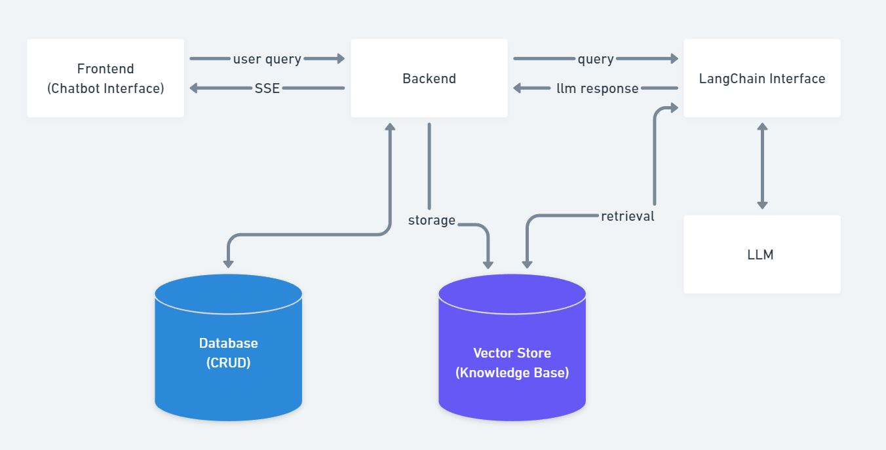
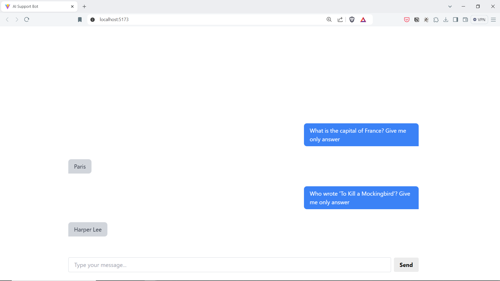

# AI Support Bot

A full stack basic AI powered chatbot capable of interacting with custom knowledgebases

## Techstack used
- React
- Tailwindcss
- FastAPI
- ChromaDB
- Langchain
- OpenAI
- Docker


## Flowchart
This diagram illustrates the high level components involved and thier interaction


## Demo


<video width="320" height="240" controls>
  <source src="./media/ai_support_bot_demo.mp4" type="video/mp4">
</video>


https://github.com/user-attachments/assets/49a82013-c936-4f13-8739-646039b77d55


## Project Configuration
Before running the project, make sure to adjust the following configuration files:

### Backend Configuration
- Adjust the `.env` file located in the backend folder if any environment variables need modification.


## Start Containers
To start the project, use Docker Compose to build and run the containers:
```
docker compose up --build
```

### Frontend URL
Once the containers are running, you can access the frontend application at:
```
http://localhost:5173/
```

### Backend URL
Once the containers are running, you can access the backend application at:
```
http://localhost:8081/
```

## Pending Improvements
- Add SQL/NoSQL DB to store the user queries and generated reponses


http://localhost:8000/api/v1/collections

https://github.com/pixegami/langchain-rag-tutorial
